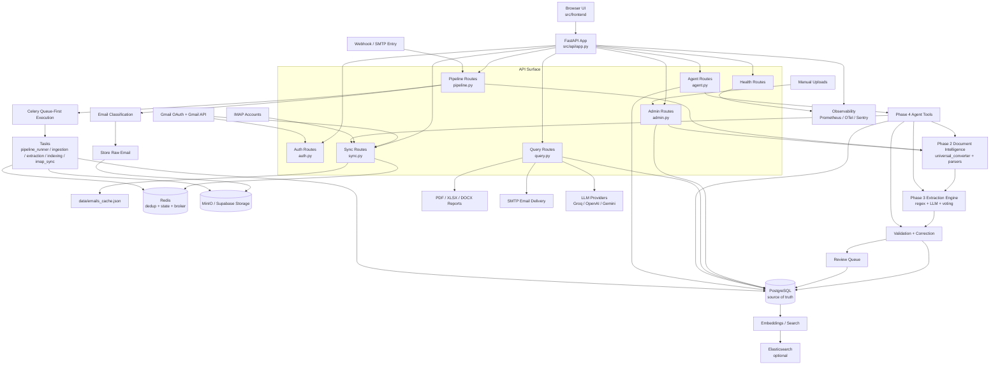
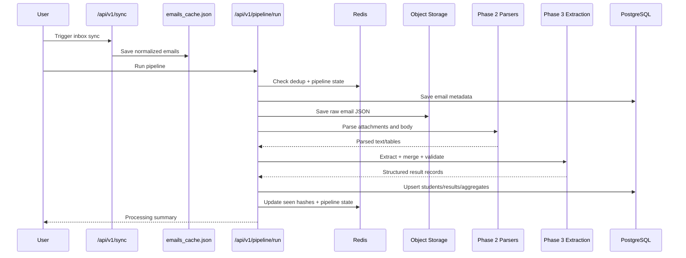

# EMAIL_AGENT Visual Architecture

This visual diagram matches the current working runtime in the repository.

## System Diagram

## Pipeline Sequence

## Notes

- `Pipeline` prefers Celery-backed execution and falls back to synchronous execution when workers are unavailable.
- `PostgreSQL` remains the canonical academic record store.
- `Redis` carries both operational state and queue support.
- `MinIO` is the active default object storage backend.
